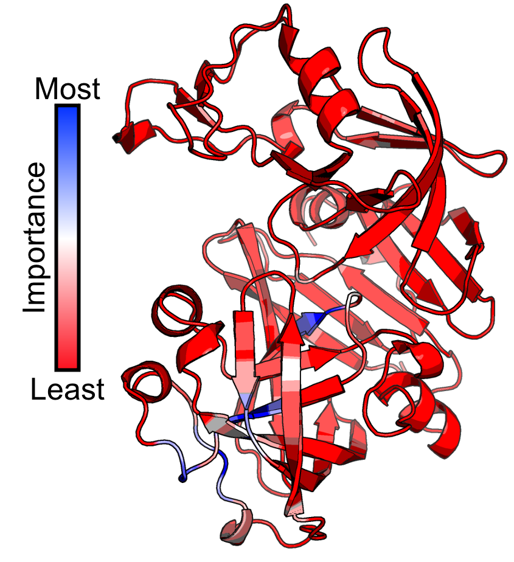
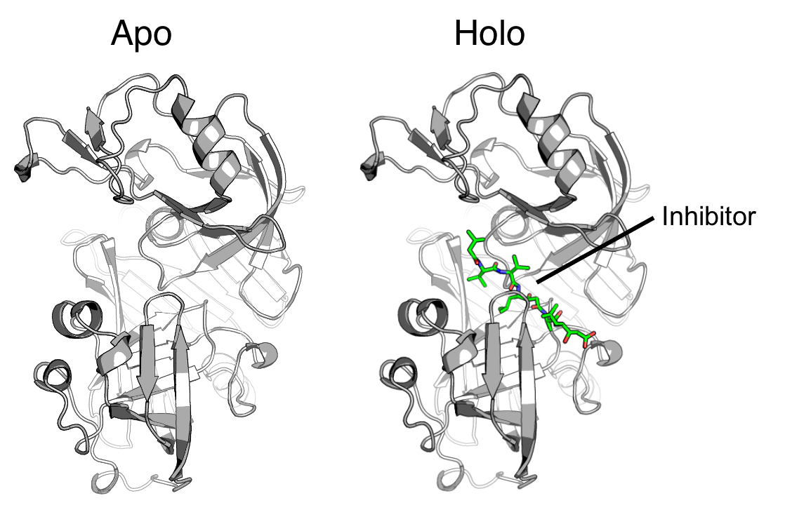
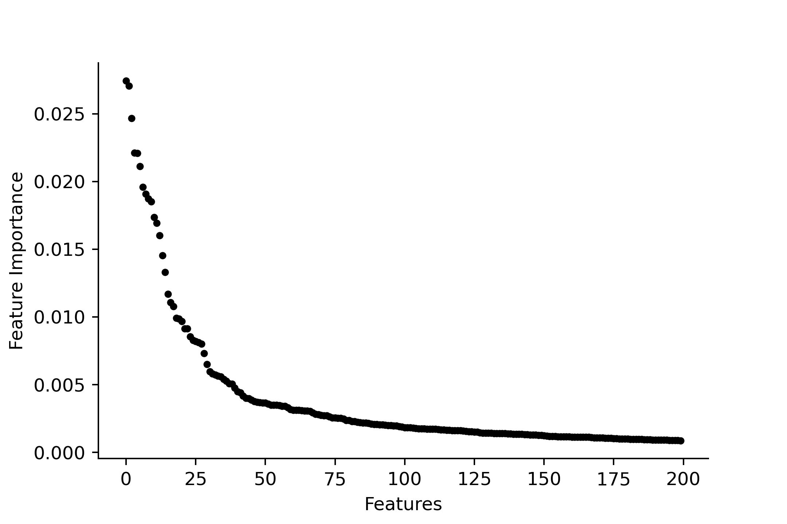
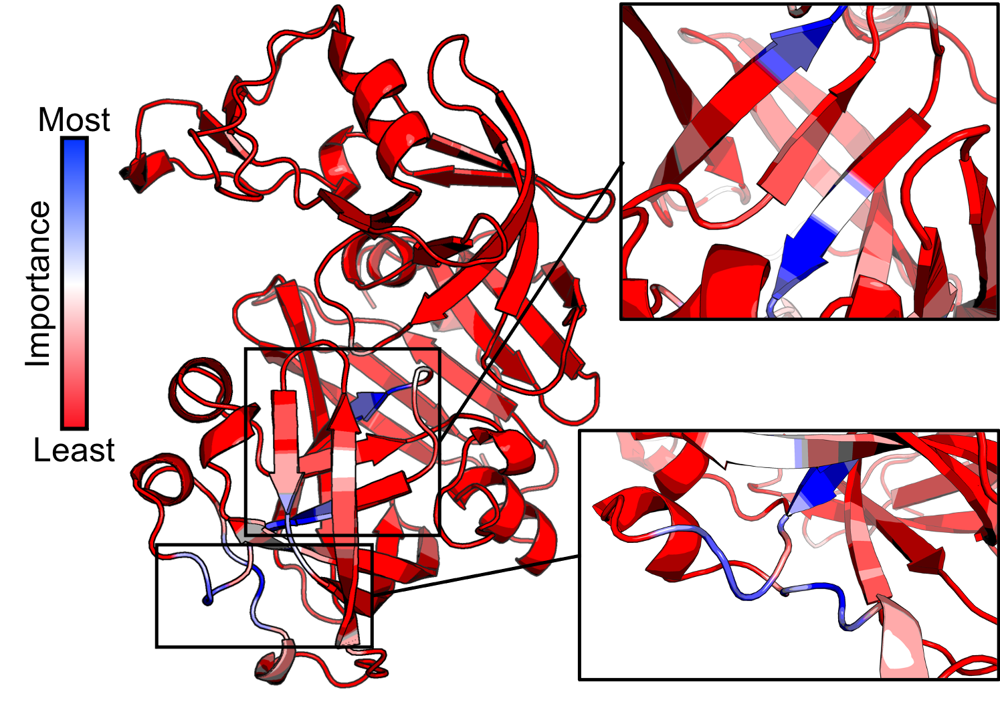

# How to use Random Forest Importance Features to Detect Differences Between MD Simulations 

<p align="center">
 
</p>

# Introduction

Looking through ensembles of molecular dynamics (MD) trajectories can be a daunting task.
Here, I show how to use the Random Forest (RF) classifier to quickly locate differences between seperate ensembles of MD simulations. 

## Example Case

<p align="center">
 
</p>

Here we will be looking at the malarial aspartyl protease Plasmepsin II (PDBid: 1SME) where one simulation has an inhibitor bound (holo) and the other is inhibitor free (apo).
By training the RF classifier between two states, in this case using inhibitor bound and unbound snap shots from MD simulations, you can use the feature importance to provide insight about the protein conformation.
The features in this can almost be anything from water positions, dihedral angles, and Cα positions.
In this example the Cα positions will be used. 
The power of using the RF classifier to to find the conformational differences is to reduce the amount of time spent by a computational chemist rigorously groom MD simulations by eye, and it has the potential to detect allosteric conformational changes that one would not think to look for. 

# Getting Started 

The first thing you need is to do is prepare the MD trajectories you are going to analyze. 

- [x] The trajecories need to be aligned, in this case the two ensmebles were aligned by the protein backbone atoms (C, Cα, N, and O).
- [x] For efficiency remove the water and ions in the aligned trajecoteries, unless you are using water as the feature of interest. 
- [x] Make a PDB file with connectivity information to view the trajectories. 
- [x] Make a PDB file of the selection you are using to detect feature importance, or one you can use to color by feature importance. 

For this process I suggest using [MDAnalysis](https://www.mdanalysis.org/).

In this example I have provided examples of the following inputs. 

- [x] apo.dcd, ligand unbound trajectories 
- [x] holo.dcd, ligand bound trajectories
- [x] check.pdb, PDB used to view the trajecotry files
- [x] pdb_for_coloring.pdb, PDB used to color by feature importance 

Note: Sometimes the check.pdb and pdb_for_color.pdb can either the same or different, in this example they are the same.

# Preparing the Dataset

Now that the MD trajectories have been prepared you can move on to making the dataset. 
A full example of this using MDAnalysis can be seen in the jupyter notebook, 'confML_apo_holo.ipynb'.
In this case the dataset will be the X, Y, and Z positions of all the Cα atoms from each frame of the trajectories.
In the example case here, I first make a dataframe from the simulation without the inhibitor (apo) and then do the same for the inhibitor bound simulation (holo).
In these dataframes the rows are the snap shots from each simulation and the columns are the X, Y, and Z coordinates.
Additionally, a new column is appended to the end of each data frame indicating the frame belongs to either the apo or holo state.
Again, these are the two states we will be classifying between.

### Sample Apo Data 

|    |   0  |   1  |   2  |   3  | ... |   986| Label |
|---:|-----:|-----:|-----:|-----:|----:|-----:|------:| 
|  0 | 5.83 | 18.58|-17.02|  7.14| ... |-18.10|  apo  |
|  1 | 7.70 |	18.93|-16.13|	 8.16| ... |-18.49|  apo  |
| ...|  ... |  ... |  ... |  ... | ... |  ... |  ...  |
|1049| 3.89 |	20.00|-12.55|	 3.21| ... |-18.90|  apo	 |
 
### Sample Holo data 

|    |   0  |   1  |   2  |   3  | ... |   986| Label |
|---:|-----:|-----:|-----:|-----:|----:|-----:|------:| 
|  0 | 12.65| 17.82|-15.83|  8.84| ... |-18.06|  holo |
|  1 | 10.38|	1754 |-14.45|	 6.83| ... |-19.07|  holo |
| ...|  ... |  ... |  ... |  ... | ... |  ... |  ...  |
|1599| 9.57 |	3.87 |-18.24|	 9.24| ... |-19.14|  holo	|

# Finalizing and Cleaning the Dataset

You might have noticed that the example dataframes have different lengths. 
So that the RF classifier can properly see the difference between the two states and is not baised towards one or the other state, the dataframes needs to have the same number of rows (meaning snapshots/frames).
I have added a short python function (see below, create_train_and_test) that randomly deletes the number of different rows from the longer dataframe and adds a new label to numerically format the apo and holo labels.
Finally the function uses the 'train_test_split' from 'sklearn.model_selection' to split the data into a training set and a testing set. 

```
def create_train_and_test(df1, df2, random_seed, label='apo', split=0.75):
    df_mod = pd.DataFrame() # The Data Frame to Modify
    df_sta = pd.DataFrame() # The Data Frame to Leave Alone
    remove_n = 0
    # Here is to clean the data
    if len(df1) > len(df2):
        df_mod = df1
        df_sta = df2
        remove_n = len(df1) - len(df2)
    else:
        df_mod = df2
        df_sta = df1
        remove_n = len(df2) - len(df1)
    drop_indices = np.random.choice(df_mod.index, remove_n, replace=False)
    df_mod = df_mod.drop(drop_indices)
    df_final = pd.concat([df_sta, df_mod])
    df_final['num_label'] = [0 if x is label else 1 for x in df_final['label']]
    train, test = train_test_split(df_final, train_size=split, test_size=(1-split), random_state=random_seed)
    return train, test
```

# Running the Random Forest Classifier

Now we create a model using the training data and see how good of a job that model is at predict whether a given frame belongs to the apo or holo simulations. 
Again, a full example of this is given in the jupyter notebook, 'confML_apo_holo.ipynb'. 
The RF classifier is build in this example using 1000 trees in the forest. 
It is not uncommon for the RF classifier to perfectly be able to predict whether a frame belongs to the apo or holo simulations. 
We are only classifying between two states and there might be a conformational feature that splits the data very nicely. 
This is not always the case and the success rate of the RF classifier should be considered when using the feature importance to understand physical meaning in MD simulations.
If the success rate is low then the supposedly high feature importances might not be very fruitfull to you understanding the difference between sets MD simulations.
In this example the success rate should be rather high at 95% or greater. 

# Feature Importance

You can obtain a list of the feature importances from the training model using just a few lines in python and sorting them from highest to lowest. 

```
# View a list of the features and their importance scores 
output = list(zip(df_train[features], rf_clf.feature_importances_))

# convert list of tuples to a a list of lists 
output = [list(temp) for temp in output]

sorted_output = sorted(output,key=lambda l:l[1], reverse=True)
```

Plotting the first 200 features shows that there are a handful of features that are particularly good at classifying the MD snap shots between the apo and holo states.
Since these features are the X, Y, and Z positions of the Cα atoms there are a few sites on the protein that differ between the apo and holo states.

<p align="center">
 
</p>

Even though this plot has been sorted by feature importance, notice the smoothness of the plot. 
An indication that the RF classifier is locking on to specific features and only uses those to classify shows up as discontinuous changes in feature importance. 
This is generally a sign the two states are so different from each other it is almost pointless to use this method or something has gone wrong with the alignment of the protein. 

# Getting the Results - Making a PDB file Colored by Feature Importance

Now that we know which features are important we need to present the results in a meaningful way to help guide our analysis of MD trajectories. 
Again, a full example of how to do this is in the jupyter notebook (confML_apo_holo.ipynb), but select details will be dicussed here. 
Now using the raw feature importances we consider the feature importances in set of three, since each Cα atom has three importance features, and select the max feature importance for that atom. 
Now we have the max feature importance for each atom we can create a PDB file for the protein and place the feature importance normalized to the max of all feature importances in the beta column of the PDB. 
The normalized feature importance for the Cα atom of each residue, will be used to color that residue.
The resulting PDB can be shown in [VMD](https://www.ks.uiuc.edu/Research/vmd/) or [PyMOL](https://pymol.org/2/) and colored by the beta column.

After loading your PDB in PyMOL you can use the following command.

```
spectrum b, red_white_blue, minimum=0, maximum=1
```

<p align="center">
 
</p>

Looking at this colored PDB file instantly shows where you need to focus your analysis when analyzing MD trajectories. 
We can see the highlighted blue areas show were the protein differs the most between the apo and holo simulations showing that the presence of the inhibitor effects these areas the most. 
Unsuprisingly we see changes in the protein substrate binding site, but conformational changes also take place on the bottom (C-terminal lobe) of the protein. 
This is a very basic demonstration of using the RF classifier on MD trajecories, this method can be focused to look at every atom in the binding site to see exactly what part of what residue is changing positions and many other scenerioes. 
This method has also been extend to looking at the displacement of water positions upon inhibitor binding, something that might be added here in the future. 

